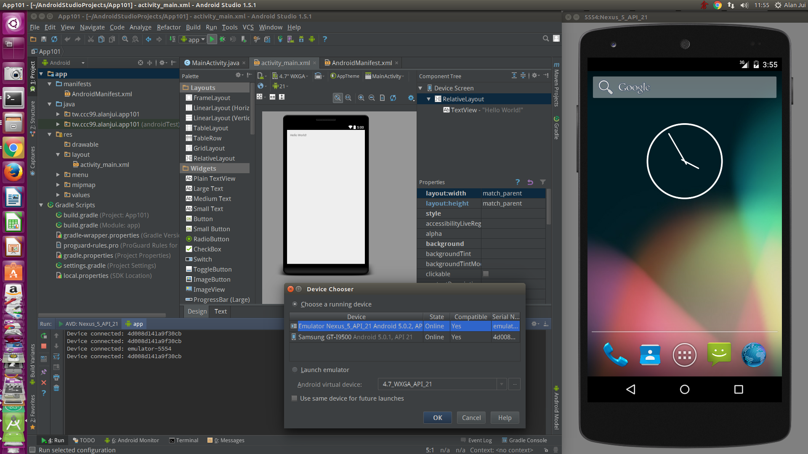

# Android Studio 安裝及設定作業




程序：
 1. 安裝 Java SE SDK 1.7 (x64)
 2. 下載 Android SDK
 3. 下載 Android Studio
 4. 安裝 Android Studio
 5. 執行 Android Studio 並設定 Android SDK, JDK 路徑
 6. 下載 Android SDK 相關套件
 7. 建立 AVD


 ## 常見問題處理

### Gradle build 失敗

```
Error:org.gradle.process.internal.ExecException: A problem occurred starting process 'command '/home/alanjui/SDK/android-sdk-linux/build-tools/21.1.2/aapt'' :app:mergeDebugResources FAILED
```

由於 Android SDK 目前仍以 32 bit 為主；對於 Ubuntu 64 bit 作業系統的支援有限。

為求 32 bit 的 SDK ，能在 Ubuntu 64 bit 的作業系統能正常運作，故需安裝如下之 32 bit Lib 套件：

```
sudo apt-get install lib32stdc++6
sudo apt-get install lib32z1
```

### 無法建 AVD

問題的根源似乎出自「SD Card 無法正常建立」，對於 `mksdcard` 檔案的「權限」需滿足：755

~/SDK/android-sdk-linux/tools/mksdcard: 755

### 晝面 Render 有問題

```
Rendering Problems Failed to load the LayoutLib: com/android/layoutlib/bridge/Bridge : Unsupported major.minor version 52.0
```


Rendering Layout 功能，預設會啟用：「Automatically Pick Best」。

因此，SDK 若是安裝了「Android N」，則晝面的預覽功能（Rendering Layout）會以「Android N」為「預設」，因此將導致問題的發生。

解決作法如下：

 * 關掉：Automatically Pick Best
 * 改撰：API 21 : Android 5.0.1


http://stackoverflow.com/questions/35914758/xml-rendering-errors-android-preview-n
