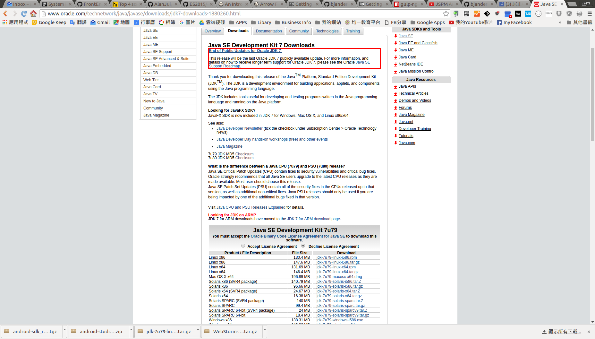
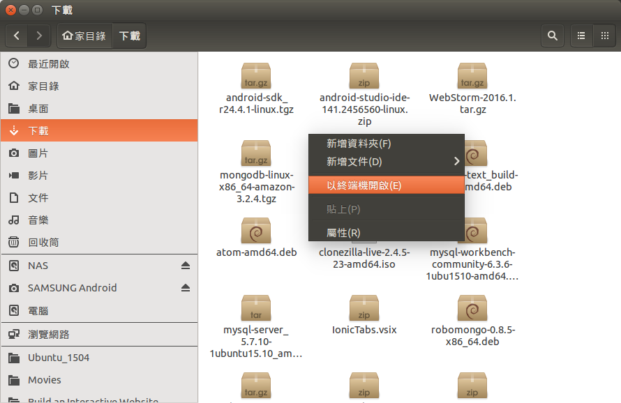

# JDK 安裝及設定作業

## 下載

URL: http://www.oracle.com/technetwork/java/javase/downloads/jdk7-downloads-1880260.html

下載檔案： Linux x64	- jdk-7u79-linux-x64.tar.gz



安裝及設定程序：

 1. 透過「檔案總管」，先進入「下載」資料夾，再啟動「終端機」。

    

 2. 執行下列指令，將已下載的壓縮檔，搬至欲安裝的目錄。

    ```
    $ mv jdk-7u79-linux-x64.tar.gz ~/SDK/Java

    $ cd ~/SDK/Java

    $ tar zxvf jdk-7u79-linux-x64.tar.gz

    $ rm jdk-7u79-linux-x64.tar.gz
    ```

 3. 設定 PATH

    使用編輯器，對檔案：.zshrc 進行設定。

    ```
    $ gedit ~/.zshrc
    ```

    設定內容：

    ```
    export JAVA_HOME=/home/alanjui/SDK/Java/jdk1.7.0_79

    PATH=$JAVA_HOME/bin:$JAVA_HOME/jre/bin:$PATH
    ```

 4. 驗證

    ```
    $ java -version

    java version "1.7.0_79"
    Java(TM) SE Runtime Environment (build 1.7.0_79-b15)
    Java HotSpot(TM) 64-Bit Server VM (build 24.79-b02, mixed mode)
    ```
