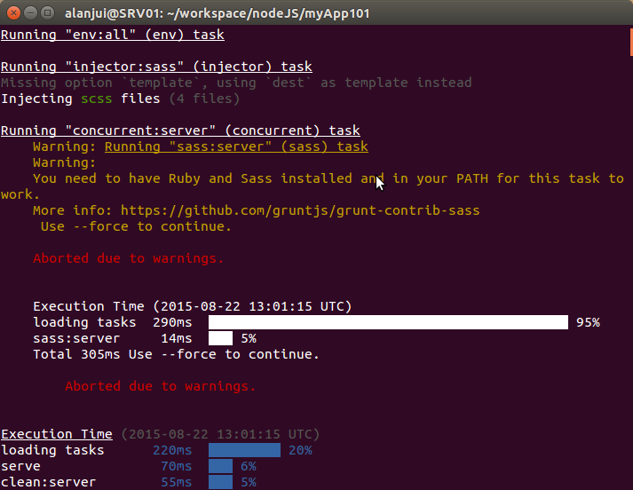
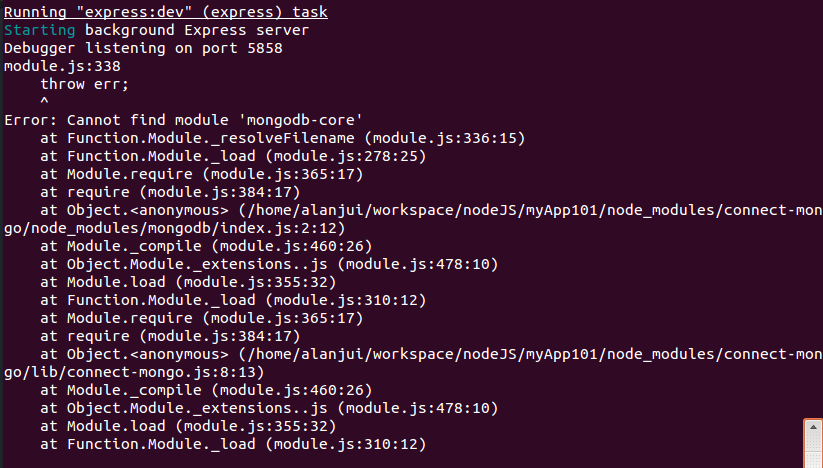
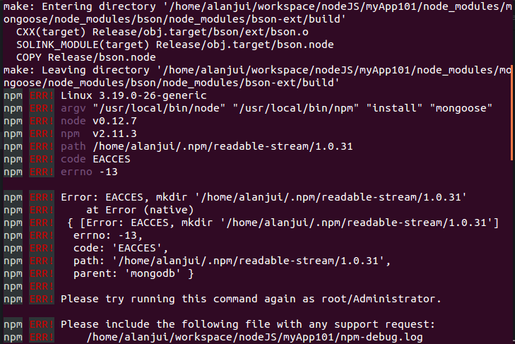
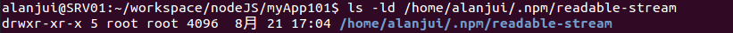

# Node 安裝及設定作業

## 安裝 node 與 npm

1. 至[官網](https://nodejs.org/en/download/)下載 BIN 檔。

   下載的`BIN 檔`為：「Linux Binaries (.tar.xz) 64 bits」。

    注意：不是 .tar.gz 檔案，那是「原始程式碼檔案」;應該是 -x64.tar.gz 。

    參考指引： [How to Install Node.js on Ubuntu 14.04 / Install Node.js with Standard Binary Packages ](http://www.hostingadvice.com/how-to/install-nodejs-ubuntu-14-04/)

2. 執行安裝指令。
  ```
	cd ~/下載
	sudo tar -C /usr/local --strip-components 1 -xzf node-v0.12.7-linux-x86.tar.gz
  ```
3. 驗證

	* 步驟一：檢查連結

  ```
  ls -l /usr/local/bin/node
  ls -l /usr/local/bin/npm
  ```

  * 步驟二：確認軟體能夠執行

  ```
  node -v
  npm -v
  ```

## 安裝常用之 node 模組

### n

npm 管理模組

  1. 安裝 n

  ```
  $ sudo npm install -g n
  ```

  2. 安裝 LTS 版本 Node

  ```
  $ sudo n lts
  ```

  3. 安裝 Latest 版本 Node

  ```
  $ sudo n latest
  ```

### node-gyp

  node Rebuild 工具

  ```
  $ sudo npm install -g node-gyp
  ```

### HTTP Server

  ```
  $ sudo npm install -g http-server
  ```

### 測試工具 Mocha

  ```
  $ sudo npm install -g mocha
  ```

### 測試工具 Karma

  ```
  $ sudo npm install -g karma-cli
  ```

### 安裝 Yeoman

#### 安裝與 Yeoman 相關套件
```
sudo npm install -g yo bower grunt-cli gulp-cli
```

#### 安裝常用的 Yeoman Generator

##### 安裝 Angular Fullstack Generator

 [Angular Fullstack Generator 官網](https://github.com/DaftMonk/generator-angular-fullstack)

Angular Fullstack Generator 須搭配以下軟體，方能正常執行：

  * MongoDB
  * Ruby & SASS

【安裝步驟】：

  1. 執行安裝指令

    ```
  	$ sudo npm install -g generator-angular-fullstack
    ```

  2. 驗證安裝結果

    執行下列指令，驗證安裝作業確實完成：

    ```
    $ cd ~/workspace/Angular  

    $ mkdir ngFS101 && cd $_  

    $ yo angular-fullstack ngFS101
    ```  

##### 安裝 hottowel Generator

  1. 執行安裝指令

    ```
  	$ sudo npm install -g generator-hottowel
    ```

  2. 驗證安裝結果

    * 建立 project 目錄

    ```
    mkdir -p ~/workspace/vs-code && cd $_
    mkdir helloWorld && cd $_  
    ```

    * 使用 hottowel generator 建立 project

    ```
    yo hottowel myApp101
    ```  

    * 執行 code 分析

    ```
    gulp vet
    ```  

    * 執行功能測試

    ```
    gulp serve-specs
    ```  

    * 執行開發中 App

    ```
    gulp serve
    ```  

    * 執行産品建製（build）

    ```
    gulp build
    ```  

    * 執行産品 App

    ```
    gulp serve-build
    ```  


# 異常處理

## 無法正常啟動 app ，有 Sass 相關錯誤狀況發生



錯誤訊息告知：「You need to have Ruby and Sass Installed and in your PATH for this task to work」。

這種狀況發生的導因，通常是因為忘了安裝 Sass ；而 Sass 的安裝係透過 gem 這個套件管理軟體來完成。所以，遇此狀況時，須先檢查 Ruby, gem, Sass 的安裝是否已完成。

## 無法正常啟動 app ，有 MongoDB 相關錯誤狀況發生。



依錯誤訊息判斷，應該是 mongoose 這模組出狀況了，故須重新安裝 mongoose 模組。

## 安裝 mongoose 模組，發生錯誤狀況

透過 npm install 安裝 mongoose 模組，結果無法順利安裝，有錯誤狀況發生。

1. 執行下列安裝指令：
  ```
  npm install mongoose
  ```

2. 發生如下所示之錯誤狀況：

  

3. 依據錯誤訊息的反應，問題導因出在目錄的使用權限。使用指令 ls -ld 查詢該目錄的權限，發覺目錄的擁有者竟是 root ，而不是正常的 alanjui 。

  

4. 使用指令，變更目錄的擁有者為 alanjui 所有，以改正問題。
  ```
  sudo chown -R alanjui:alanjui /home/alanjui/.npm/readable-stream
  ```

## 懷疑 npm 模組在安裝的時候發生問題

執行 grunt serve 指令，卻發生 app 無法正常啟動的問題，懷疑在 npm install 階段，可能有 npm 的模組未正常完成安裝。

這種狀況可能發生的時機，譬如：透過 Yeoman Generator 在建置 project 的時候，卻忘了先安裝 node-gyp 的模組。

```
rm -rf node_modules && npm install
```
