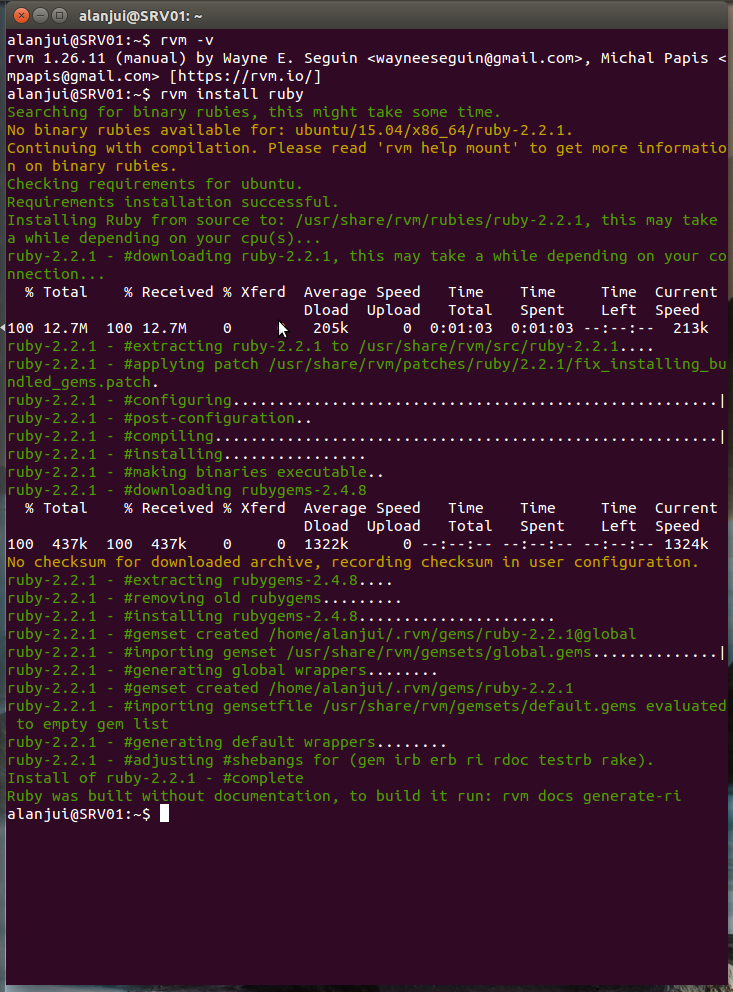

Ruby 與 Sass 安裝
==============

## 透過 RVM 安裝 Ruby

1. 匯入 GPG 公鑰
    ```
    gpg --keyserver hkp://keys.gnupg.net --recv-keys 409B6B1796C275462A1703113804BB82D39DC0E3
    ```

2. 執行安裝指令
    ```
    sudo curl -sSL https://get.rvm.io | bash -s stable --ruby
    ```

3. 令終端機可立即使用 rvm 指令
    ```
    source /usr/share/rvm/scripts/rvm
    ```

4. 驗證

  * 使用 rvm 的指令檢查軟體版本，驗證已能正常執行。

  ```
  alanjui@SRV01:~$ rvm -v
  rvm 1.26.11 (latest) by Wayne E. Seguin <wayneeseguin@gmail.com>, Michal Papis <mpapis@gmail.com> [https://rvm.io/]
  ```

  * 使用 rvm 的 ls 指令，檢查目前預設使用的 Ruby 語言版本

  ```
  alanjui@SRV01:~$ rvm ls

  rvm rubies

  =* ruby-2.2.1 [ x86_64 ]

  # => - current
  # =* - current && default
  #  * - default
  ```

  * 使用 ruby 的指令檢查軟體版本，驗證已能正常執行。

  ```
  alanjui@SRV01:~$ ruby -v
  ruby 2.2.1p85 (2015-02-26 revision 49769) [x86_64-linux]

  ```

  * 使用 gem 的指令檢查軟體的版本，驗證已能正常執行。

  ```
  alanjui@SRV01:~/workspace/nodeJS/myApp101$ gem -v
  2.4.8
  ```

## 安裝 Sass

使用 gem 的指令安裝。

```
alanjui@SRV01:~$ gem install sass
Fetching: sass-3.4.17.gem (100%)
Successfully installed sass-3.4.17
Parsing documentation for sass-3.4.17
Installing ri documentation for sass-3.4.17
Done installing documentation for sass after 4 seconds
1 gem installed
```

## 安裝 Jekyll

這並非必要安裝，但也可當成是 gem 是否已安裝；且能正常執行的驗證。

1. 執行 gem 安裝指令
  ```
  alanjui@SRV01:~$ gem install jekyll
  Fetching: fast-stemmer-1.0.2.gem (100%)
  Building native extensions.  This could take a while...
  Successfully installed fast-stemmer-1.0.2
  Fetching: classifier-reborn-2.0.3.gem (100%)
  Successfully installed classifier-reborn-2.0.3
  Fetching: ffi-1.9.10.gem (100%)
  Building native extensions.  This could take a while...
  Successfully installed ffi-1.9.10
  ......
  ......
  ......
  Parsing documentation for liquid-2.6.3
  Installing ri documentation for liquid-2.6.3
  Parsing documentation for jekyll-2.5.3
  Installing ri documentation for jekyll-2.5.3
  Done installing documentation for fast-stemmer, classifier-reborn, ffi, rb-inotify, rb-fsevent, hitimes, timers, celluloid, listen, jekyll-watch, jekyll-sass-converter, execjs, coffee-script-source, coffee-script, jekyll-coffeescript, jekyll-gist, jekyll-paginate, blankslate, parslet, toml, redcarpet, posix-spawn, yajl-ruby, pygments.rb, colorator, safe_yaml, mercenary, kramdown, liquid, jekyll after 16 seconds
  30 gems installed
  ```

2. 建立 Jekyll 網站，並執行

  ```
  alanjui@SRV01:~$ mkdir -p ~/workspace/jekyll
  alanjui@SRV01:~$ cd ~/workspace/jekyll
  alanjui@SRV01:~/workspace/jekyll$ jekyll new my-awesome-site
  New jekyll site installed in /home/alanjui/workspace/jekyll/my-awesome-site.
  alanjui@SRV01:~/workspace/jekyll$ cd my-awesome-site/
  alanjui@SRV01:~/workspace/jekyll/my-awesome-site$ jekyll serve
  Configuration file: /home/alanjui/workspace/jekyll/my-awesome-site/_config.yml
              Source: /home/alanjui/workspace/jekyll/my-awesome-site
         Destination: /home/alanjui/workspace/jekyll/my-awesome-site/_site
        Generating...
                      done.
   Auto-regeneration: enabled for '/home/alanjui/workspace/jekyll/my-awesome-site'
  Configuration file: /home/alanjui/workspace/jekyll/my-awesome-site/_config.yml
      Server address: http://127.0.0.1:4000/
    Server running... press ctrl-c to stop.
  ```

  

# 參考資料

## 使用 RVM 安裝 ruby

參考網路文章：

[Install RVM (Ruby Version Manager) in Ubuntu via PPA](http://www.webupd8.org/2014/11/how-to-install-rvm-ruby-version-manager.html)

該文章建議，應先安裝 RVM （功能類似 NodeJS 中的 n ），以便未來可以任意切換 Ruby 語言使用的版本。

但是這個作法，未能正常執行，會有些異常狀況發生。

1. To add Rael's PPA and install RVM in Ubuntu (and derivatives), use the following commands:

  ```
  sudo apt-add-repository ppa:rael-gc/rvm
  sudo apt-get update
  sudo apt-get install rvm

    Creating group 'rvm'

    Installing RVM to /usr/share/rvm/
    Installation of RVM in /usr/share/rvm/ is almost complete:

      * First you need to add all users that will be using rvm to 'rvm' group,
        and logout - login again, anyone using rvm will be operating with `umask u=rwx,g=rwx,o=rx`.

      * To start using RVM you need to run `source /etc/profile.d/rvm.sh`
        in all your open shell windows, in rare cases you need to reopen all shell windows.
        ```
2. Setup for run rvm under terminal

  ```
  $ source /etc/profile.d/rvm.sh
  ```

3.  Restart your session (logout and login).

  執行安裝指令： __rvm install ruby__

  ```
  alanjui@SRV01:~$ rvm install ruby
  Searching for binary rubies, this might take some time.
  No binary rubies available for: ubuntu/15.04/x86_64/ruby-2.2.1.
  Continuing with compilation. Please read 'rvm help mount' to get more information on binary rubies.
  Checking requirements for ubuntu.
  Requirements installation successful.
  Installing Ruby from source to: /usr/share/rvm/rubies/ruby-2.2.1, this may take a while depending on your cpu(s)...
  ruby-2.2.1 - #downloading ruby-2.2.1, this may take a while depending on your connection...
    % Total    % Received % Xferd  Average Speed   Time    Time     Time  Current
                                   Dload  Upload   Total   Spent    Left  Speed
    0     0    0     0    0     0      0      0 --:--:--  0:00:01 --:--:--     0Warning: Failed to create the file ruby-2.2.1.tar.bz2.part:
  Warning: 拒絕不符權限的操作
  curl: (23) Failed writing body (0 != 999)
  There was an error(23).
  Checking fallback: http://ftp.ruby-lang.org/pub/ruby/2.2/ruby-2.2.1.tar.bz2
    % Total    % Received % Xferd  Average Speed   Time    Time     Time  Current
                                   Dload  Upload   Total   Spent    Left  Speed
    0     0    0     0    0     0      0      0 --:--:-- --:--:-- --:--:--     0Warning: Failed to create the file ruby-2.2.1.tar.bz2.part:
  Warning: 拒絕不符權限的操作
  curl: (23) Failed writing body (0 != 4007)
  There was an error(23).
  Failed download
  There has been an error fetching the ruby interpreter. Halting the installation.
  ```

4. 重新開機，再執行安裝指令。



5. 驗證

  * 使用 ruby 的指令檢查版本，驗證 ruby 已能正常執行。

  ```
  alanjui@SRV01:~/workspace/nodeJS/myApp101$ ruby -v
  ruby 2.1.2p95 (2014-05-08) [x86_64-linux-gnu]
  ```

  * 使用 rvm 檢查目前使用的 ruby 語言版本，與前面所示是否前後一致

   ```
  alanjui@SRV01:~/workspace/nodeJS/myApp101$ rvm list
  ```
